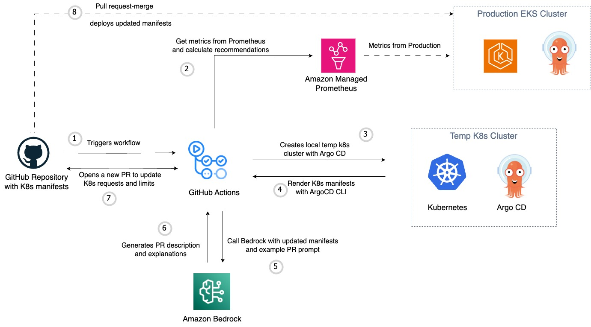

# K8s Limits Auto Resizer

A tool that optimizes Kubernetes resource limits and requests based on historical usage patterns.

## Summary
K8s Limits Auto Resizer optimizes Kubernetes resource configurations through historical usage pattern analysis. It implements Prophet, Ensemble, and Time-aware approaches to set optimal CPU and memory settings. The tool integrates with Amazon Managed Prometheus (AMP) for metrics collection and supports ArgoCD workflows. Core features include business hours awareness, trend detection, and time window analysis. Users can run it locally or integrate it into CI/CD pipelines with GitHub Actions.

## Prerequisites
Before using this tool, please review the [PreRequirements documentation](../PreRequirements/README.md) for setup instructions and prerequisites.

## Solution Architecture


## Demo

https://github.com/user-attachments/assets/0cef1202-50f4-4548-997a-dce2e02c8625


## Prerequisites
* [AWS Account](https://portal.aws.amazon.com/billing/signup/iam?#)
* Create an [IAM role for Bedrock](https://docs.aws.amazon.com/bedrock/latest/userguide/getting-started.html#getting-started-bedrock-role)
* [Request Access to the Bedrock Foundation Model](https://docs.aws.amazon.com/bedrock/latest/userguide/getting-started.html#getting-started-model-access) to be used in your target AWS region. For this example we use `Claude 3 Sonnet`.
* For production use with GitHub Actions: 
  * Set up [IAM roles for GitHub Actions](https://aws.amazon.com/blogs/security/use-iam-roles-to-connect-github-actions-to-actions-in-aws/) instead of using access keys
  * Configure OIDC provider in your AWS account to establish trust with GitHub
  * Create an IAM role with appropriate permissions for AMP access

## Running Locally (For testing only)

### 1. Build Docker image locally
```bash
docker build --no-cache -t k8sresourceautoresizer -f Docker/Dockerfile .
```

### 2. Run local development environment (interactive mode)
Use this mode for development and testing:
```bash
docker run -it \
  --network=host \
  -v /var/run/docker.sock:/var/run/docker.sock \
  -v $(pwd)/kube:/root/.kube \
  -v $(pwd):/app \
  -e CLUSTER_NAME=eks-blog-demo \
  -e RUN_LOCAL=true \
  k8sresourceautoresizer
```

### 3. Run with ensemble strategy for resource optimization
This mode performs actual resource optimizations:
```bash
# For local development with AWS credentials
docker run -it \
  --network=host \
  -v /var/run/docker.sock:/var/run/docker.sock \
  -v $(pwd)/kube:/root/.kube \
  -v $(pwd):/app \
  -e CLUSTER_NAME=eks-blog-demo \
  -e AWS_ACCESS_KEY_ID=your-access-key \
  -e AWS_SECRET_ACCESS_KEY=your-secret-key \
  -e AWS_REGION=your-region \
  -e AMP_WORKSPACE_ID=your-workspace-id \
  -e GITHUB_REPOSITORY_NAME=your-repo-name \
  -e GITHUB_USERNAME=your-gh-username \
  -e GITHUB_TOKEN=your-gh-token \
  k8sresourceautoresizer \
  sh -c "/app/k8s-limits \
    --directory /app/manifests \
    --strategy ensemble \
    --history-window 24h \
    --cpu-percentile 95.0 \
    --memory-buffer 1.15 \
    --debug"

```

## CI/CD Configuration
This project provides a [DOCKERFILE](./Docker/Dockerfile), that you can use to build and run it on your preferred CI/CD tool. We provide an example of how to integrate this with [GitHub Actions](../.github/workflows/run-optimization-and-pr-automation.yml). The `K8sLimitsAutoResizer` docker image is meant to run on CI/CD you have your K8s manifests and argocd projects. Check the `Docker`, `Usage`, and `Configuration` sections below.

### GitHub Actions Setup with IAM Roles (Recommended for Production)
For production use, we recommend using IAM roles instead of access keys:

```yaml
name: Resource Analyzer

on:
  workflow_dispatch:
    inputs:
      strategy:
        description: 'Resource recommendation strategy'
        type: choice
        options:
          - basic
          - time_aware
          - trend_aware
          - workload_aware
          - quantile_regression
          - moving_average
          - prophet
          - ensemble
        default: 'ensemble'
        required: true
      history_window:
        description: 'Historical data window (e.g., 24h, 7d, 8w, 1yr)'
        type: string
        default: '24h'
        required: true
      cpu_percentile:
        description: 'CPU percentile for recommendations'
        type: number
        default: 95.0
        required: true
      memory_buffer:
        description: 'Memory buffer multiplier (e.g., 1.15 for 15% buffer)'
        type: number
        default: 1.15
        required: true
      business_hours_start:
        description: 'Business hours start (0-23)'
        type: number
        default: 9
        required: false
      business_hours_end:
        description: 'Business hours end (0-23)'
        type: number
        default: 17
        required: false
      business_days:
        description: 'Business days (comma-separated, 0=Monday, 6=Sunday)'
        type: string
        default: '0,1,2,3,4'
        required: false
      trend_threshold:
        description: 'Trend threshold'
        type: number
        default: 0.1
        required: false
      high_variance_threshold:
        description: 'High variance threshold'
        type: number
        default: 0.5
        required: false
  schedule:
    - cron: '0 0 * * *'  # Runs daily at midnight UTC

jobs:
  analyze-resources:
    runs-on: ubuntu-latest
    permissions:
      id-token: write
      contents: read
    
    steps:
      - name: Checkout repository
        uses: actions/checkout@v4

      - name: Login to AWS ECR Public
        uses: aws-actions/configure-aws-credentials@v4
        with:
          role-to-assume: ${{ secrets.AWS_IAM_ROLE }}
          role-session-name: GitHub_to_AWS_via_FederatedOIDC
          aws-region: ${{ secrets.AWS_REGION }}

      - name: Sts GetCallerIdentity
        run: |
          aws sts get-caller-identity
      
      - name: Run resource analyzer
        env:
          BUSINESS_HOURS_START: ${{ github.event.inputs.business_hours_start || 9 }}
          BUSINESS_HOURS_END: ${{ github.event.inputs.business_hours_end || 17 }}
          BUSINESS_DAYS: ${{ github.event.inputs.business_days || '0,1,2,3,4' }}
          TREND_THRESHOLD: ${{ github.event.inputs.trend_threshold || 0.1 }}
          HIGH_VARIANCE_THRESHOLD: ${{ github.event.inputs.high_variance_threshold || 0.5 }}
          GIT_TOKEN: ${{ secrets.GIT_TOKEN }}
          GITHUB_REPOSITORY_NAME: ${{ github.event.repository.name }}
          GITHUB_USERNAME: ${{ github.repository_owner }}
        run: |
          # Create base temp directory
          TEMP_BASE=$(mktemp -d)
          mkdir -p ${TEMP_BASE}/TEMP
          echo "TEMP_BASE=${TEMP_BASE}" >> $GITHUB_ENV
          
          docker run --rm \
            --network=host \
            -v /var/run/docker.sock:/var/run/docker.sock \
            -v ${{ github.workspace }}:/app/manifests \
            -v ${TEMP_BASE}:${TEMP_BASE} \
            -v ~/.aws:/root/.aws \
            -e AWS_REGION \
            -e AWS_DEFAULT_REGION \
            -e AWS_ACCESS_KEY_ID \
            -e AWS_SECRET_ACCESS_KEY \
            -e AWS_SESSION_TOKEN \
            -e AWS_SECURITY_TOKEN \
            -e AWS_ROLE_ARN \
            -e AWS_WEB_IDENTITY_TOKEN_FILE \
            -e AMP_WORKSPACE_ID=${{ secrets.AMP_WORKSPACE_ID }} \
            -e CLUSTER_NAME=${{ secrets.CLUSTER_NAME }} \
            -e BUSINESS_HOURS_START=${BUSINESS_HOURS_START} \
            -e BUSINESS_HOURS_END=${BUSINESS_HOURS_END} \
            -e BUSINESS_DAYS=${BUSINESS_DAYS} \
            -e TREND_THRESHOLD=${TREND_THRESHOLD} \
            -e HIGH_VARIANCE_THRESHOLD=${HIGH_VARIANCE_THRESHOLD} \
            -e GIT_TOKEN=${{ secrets.GIT_TOKEN }} \
            -e GITHUB_REPOSITORY_NAME=${GITHUB_REPOSITORY_NAME} \
            -e GITHUB_USERNAME=${GITHUB_USERNAME} \
            -e TEMP_BASE=${TEMP_BASE} \
            public.ecr.aws/y3y8k7w5/k8sresourceautoresizer:latest \
            sh -c "/app/k8s-limits \
              --directory /app/manifests \
              --output ${TEMP_BASE}/TEMP/output.yaml \
              --strategy ${{ github.event.inputs.strategy || 'ensemble' }} \
              --history-window ${{ github.event.inputs.history_window || '24h' }} \
              --cpu-percentile ${{ github.event.inputs.cpu_percentile || 95.0 }} \
              --memory-buffer ${{ github.event.inputs.memory_buffer || 1.15 }} \
              --debug"
```

## Features

- Multiple prediction strategies (Prophet, Ensemble, Time-aware, etc.)
- Support for various time windows for historical analysis
- Business hours awareness
- Trend detection and analysis
- Integration with Amazon Managed Prometheus (AMP)
- ArgoCD integration for GitOps workflows

## How It Works

The resource optimization process follows these steps:

1. **Data Collection**
   - Connects to Amazon Managed Prometheus (AMP)
   - Queries historical CPU and memory usage metrics
   - Collects data for specified time window (default: 24h)

2. **Resource Analysis**
   - Processes historical usage patterns
   - Identifies deployment and container configurations
   - Analyzes metrics using the selected strategy:
     * Basic statistical analysis
     * Time-based patterns
     * Workload characteristics
     * Growth trends
     * Seasonal variations

3. **Recommendation Generation**
   - Calculates optimal resource requests and limits
   - Applies safety buffers and constraints
   - Determines recommendation severity levels
   - Generates detailed recommendations per container

4. **Manifest Processing**
   - Locates relevant Kubernetes manifests
   - Supports both Helm charts and Kustomize configurations
   - Identifies resource definition locations
   - Validates manifest structures

5. **Resource Updates**
   - Updates resource configurations in manifests
   - Maintains file formatting and structure
   - Tracks modified deployments and files
   - Preserves existing configurations

6. **GitOps Integration**
   - Integrates with ArgoCD for deployment
   - Creates or updates manifests
   - Maintains GitOps workflow
   - Ensures proper synchronization

7. **Output Generation**
   - Creates detailed JSON report with:
     * Strategy metadata
     * Configuration details
     * Updated deployments
     * Resource recommendations
   - Logs all actions and changes

8. **Validation & Safety**
   - Enforces minimum/maximum resource limits
   - Validates all recommendations
   - Maintains safety buffers
   - Ensures backward compatibility

## Time Window Formats

The tool supports various human-readable time formats for specifying the historical data analysis window:

### Supported Formats
- **Hours**: `24h`, `12h`, etc.
- **Days**: `7d`, `14d`, etc.
- **Weeks**: `1w`, `2w`, `8w`, etc.
- **Years**: `1yr`, `2yr`, etc.

### Common Use Cases
- `24h` - Daily patterns (default)
- `7d` - Weekly patterns
- `4w` - Monthly patterns
- `1yr` - Yearly patterns

You can specify the time window using the `--history-window` flag:
```bash
k8s-limits --directory /app/manifests --strategy prophet --history-window 7d
```

Or via environment variable in `.env`:
```env
HISTORY_WINDOW=7d
```

## Resource Optimization Strategies

### Basic Strategy
Simple statistical analysis using percentiles and standard deviations of historical resource usage. Best for workloads with stable, consistent resource patterns.
- Uses: Mean, median, and percentile calculations
- Good for: Stable applications with predictable resource usage
- Limitations: Doesn't account for time patterns or trends

### Time-Aware Strategy
Analyzes resource usage patterns based on business hours vs. non-business hours, recognizing that applications often have different resource needs during working hours.
- Uses: Time-based segmentation of metrics
- Good for: Applications with clear business-hour patterns
- Considers: Defined business hours, weekdays vs. weekends
- Limitations: May not catch seasonal or monthly patterns

### Trend-Aware Strategy
Identifies long-term resource usage trends, helping predict future needs based on historical growth or reduction patterns.
- Uses: Linear regression and trend analysis
- Good for: Applications with steady growth or seasonal patterns
- Considers: Weekly, monthly, and quarterly trends
- Limitations: May be sensitive to outliers

### Workload-Aware Strategy
Analyzes different types of workload patterns (batch jobs, web services, etc.) and their specific resource usage characteristics.
- Uses: Pattern recognition and workload classification
- Good for: Mixed workload environments
- Considers: Peak usage periods, idle times, and burst patterns
- Limitations: Requires sufficient historical data to identify patterns

### Quantile Regression Strategy
Advanced statistical modeling that focuses on different percentiles of resource usage, providing more nuanced recommendations.
- Uses: Quantile regression analysis
- Good for: Applications with variable resource usage
- Considers: Multiple percentiles for better accuracy
- Limitations: Computationally more intensive

### Moving Average Strategy
Time series analysis using different types of moving averages to smooth out short-term fluctuations.
- Uses: Simple, weighted, and exponential moving averages
- Good for: Noisy data with short-term variations
- Considers: Recent trends with configurable time windows
- Limitations: May lag behind sudden changes

### Prophet Strategy
Implements Facebook's Prophet forecasting tool for sophisticated time series predictions.
- Uses: Facebook's Prophet algorithm
- Good for: Complex seasonal patterns and holiday effects
- Considers: Multiple seasonality, holidays, and trends
- Limitations: Requires more computational resources

### Ensemble Strategy
Combines predictions from multiple strategies using weighted averaging for more robust recommendations.
- Uses: Weighted combination of all other strategies
- Good for: Production environments requiring high reliability
- Considers: Confidence levels from each strategy
- Limitations: May be more conservative in its recommendations

## Strategy Selection
- For simple applications: Basic or Moving Average
- For business applications: Time-Aware or Workload-Aware
- For growing applications: Trend-Aware
- For complex patterns: Prophet or Ensemble
- For maximum reliability: Ensemble

- Automatic resource recommendations for:
  - CPU requests and limits
  - Memory requests and limits

- Integration with:
  - Amazon Managed Prometheus (AMP)
  - Argo CD
  - EKS
  - Bedrock

## Installation

```bash
# Install basic version
poetry install

```

## Usage

### Command Line
```bash
# Basic usage
python -m K8sResourceResizer.Src.main --directory /path/to/manifests

# With specific strategy
python -m K8sResourceResizer.Src.main --strategy ensemble --directory /path/to/manifests

# Debug mode
python -m K8sResourceResizer.Src.main --debug --directory /path/to/manifests
```

### Docker Usage
For Docker-based usage, refer to the [Running Locally](#running-locally) section above where detailed instructions are provided for:
- Building the Docker image
- Running in local development mode
- Running with resource optimization
- Production setup with GitHub Actions and IAM roles

The container supports two main modes:
1. **Local Development** (first command):
   - Interactive mode with `-it`
   - Keeps container running with `RUN_LOCAL=true`
   - Mounts kubeconfig and application directory
   - Exposes ArgoCD UI (8080) and Kubernetes API (6550) ports

2. **Resource Optimization** (second command):
   - Runs ensemble strategy for optimal resource recommendations
   - Uses IAM roles via AWS profiles for secure authentication
   - Configurable parameters for fine-tuning recommendations
   - Outputs results to mounted volumes

Both approaches use secure configuration:
- No privileged mode needed
- Docker socket mounted for DinD operations
- Host network access for better compatibility

## Configuration

Environment variables:
- `AMP_WORKSPACE_ID`: Amazon Managed Prometheus workspace ID
- `AWS_REGION`: AWS region
- `BUSINESS_HOURS_START`: Start of business hours (default: 9)
- `BUSINESS_HOURS_END`: End of business hours (default: 17)
- `BUSINESS_DAYS`: Business days (default: 0,1,2,3,4 where 0=Monday)
- `RUN_LOCAL`: Set to "true" to keep container running for local development (default: false)
- `CLUSTER_NAME`: Name of the k3d cluster to create
- `GITHUB_REPOSITORY_NAME`: Name of the GitHub Repository
- `GITHUB_USERNAME`: GitHub user name
- `GITHUB_TOKEN`: GitHub token for authentication

## License

MIT License 
